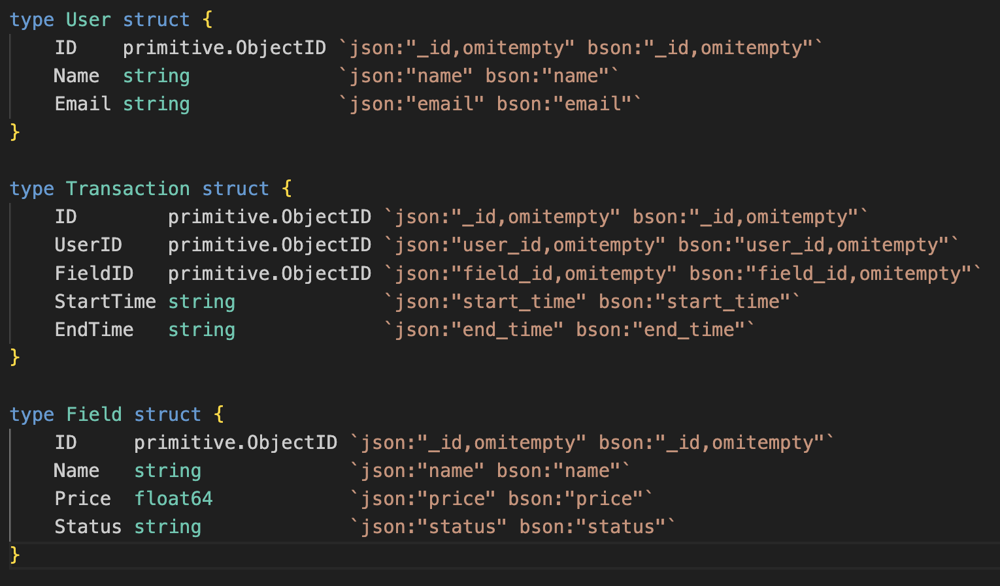

# Graded Challenge 1 - P3

Graded Challenge ini dibuat guna mengevaluasi pembelajaran pada Hacktiv8 Program Fulltime Golang khususnya pada pembelajaran mongoDB dan implementasi terhadap aplikasi golang

## Assignment Objectives
Graded Challenge 1 ini dibuat guna mengevaluasi pemahaman mongoDB sebagai berikut:

- Mampu memahami konsep Mongo DB
- Mampu mengimplementasikan Mongo DB ke REST APi Golang

## Assignment Directions: Restful API - Sewa Lapangan Bola
Buatlah sebuah REST API dengan menggunakan Echo Golang dan implementasikan database MongoDB sesuai dengan kriteria yang telah ditentukan

Requirements:

To achieve this, you need to implement the following endpoints:

	- /transactions (POST) - Create a new transactions
	- /transactions (GET) - Retrieve all transactions
	- /transactions/{id} (GET) - Retrieve a specific transactions by ID
	- /transactions/{id} (PUT) - Update a transaction informations
	- /transactions/{id} (DELETE) - Delete a transaction informations

Gunakan function untuk handle error seperti yang dilakukan pada phase 2, Kalian harus menggunakan mongodb untuk menyimpan dan melakukan transaksi penyewaan lapangan.

#### Sebagai tambahan dari requirement yang sudah diberikan sebelumnya, Student juga diharapkan untuk memahami dan menerapkan konsep-konsep berikut:
- Cloud Deployment using GCP
Student diharapkan untuk mengimplementasikan Cloud Deployment menggunakan Google Cloud Platform (GCP).
Pastikan aplikasi Anda dapat diakses secara publik setelah deployment.
Sediakan dokumentasi sederhana mengenai langkah-langkah deployment yang Anda lakukan.
- Job Scheduling
Implementasikan konsep job scheduling untuk beberapa proses yang memerlukannya, seperti proses pembaharuan data atau pembersihan data yang tidak diperlukan.
- Unit Test
Buat unit test untuk memastikan bahwa setiap fungsi atau method dalam aplikasi Anda bekerja dengan semestinya.
- Docker
Kontainerisasi aplikasi Anda menggunakan Docker.
Pastikan Anda menyediakan Dockerfile dan dokumentasi singkat tentang bagaimana menjalankan aplikasi Anda menggunakan Docker.

## Database Schema

Buatlah database dengan skema mengikuti sample struct yang ada pada gambar diatas!

## Expected Results

- Aplikasi berjalan pada http://url-google-cloud/
  ### Image sample

- API memiliki fungsi endpoint seperti berikut :
	- /transactions (POST) - Create a new transactions
	- /transactions (GET) - Retrieve all transactions
	- /transactions/{id} (GET) - Retrieve a specific transactions by ID
	- /transactions/{id} (PUT) - Update a transaction informations
	- /transactions/{id} (DELETE) - Delete a transaction informations

----------

### RESTRICTION:
- The id field should be the primary key for the table.
- The email field should have a unique index to prevent duplicate email addresses.

---------- 

###  Assignment Submission

Push Assigment yang telah Anda buat ke akun Github Classroom Anda masing-masing.

----------

## Assignment Rubrics

Aspect : 
|Criteria|Meet Expectations|Points|
|---|---|---|
|Problem Solving|5 API Endpoints are implemented and working correctly (@15 each) |75 pts |
|Database Design |MongoDB database meets the required specifications |10 pts|
||Database queries are efficient and appropriately indexed |5 pts|
|Readability|Code is well-documented and easy to read |5 pts|
||Code includes appropriate comments and documentation |5 pts|

Notes:
- Don't rush through the problem or try to solve it all at once.
- Don't copy and paste code from external sources without fully understanding how it works.
- Don't hardcode values or rely on assumptions that may not hold true in all 
cases.
- Don't forget to handle error cases or edge cases, such as invalid input or unexpected behavior.
- Don't hesitate to refactor your code or make improvements based on feedback or new insights.

Total Points : 100

Notes Deadline : W2D1 - 9.00AM

Keterlambatan pengumpulan tugas mengakibatkan skor GC 1 menjadi 0.
